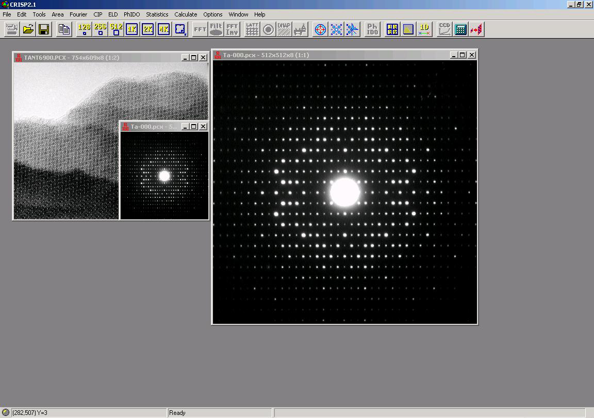
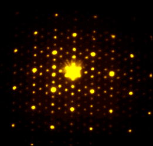

# CRISP + ELD

This is the source code for the CRISP/ELD software, developed by Calidris.

# CRISP

# Image processing of electron micrographs

CRISP uses the techniques of crystallographic image processing to extract information from electron micrographs. The techniques are fully applicable to any crystallographic specimen, inorganic, organic or biological.

## Easy to use, Productive, Fast

CRISP is easy to install, easy to learn and fast to use. The automatic installation procedure takes only minutes, and we can assure you that you will produce useful results on the same day as you receive it. CRISP uses an intuitive Windows interface, and all common commands are immediately available through a toolbar. Extensive on-line help is available at the click of the mouse.
Crystallographic averaging gives a vastly increased signal to noise ratio which can be further increased by application of crystallographic symmetry.

An electron micrograph of cytochrome reductase before processing by CRISP:

The same micrograph after processing:

Full three dimensional information can be retrieved by CRISP by processing the micrographs in a tilt series. Click to see the information about our 3D products - TriMerge, and eMap.
Further, advanced processing techniques in the Fourier transform allow correction for the effects of the contrast transfer function, defocus levels and astigmatism. image processed by CRISP

On the left is shown an original micrograph of K7Nb15W13O80. The smaller panel in the centre shows the same micrograph after reconstruction. Now the atom positions (black spots) are clearly visible. On the right is the calculated Fourier transform, showing the level of focus and astigmatism in the image.

# Analysis of dislocations

On the left: the original image, on the right the filtered image after processing by CRISP. A dislocation is clearly seen at 9 o'clock.

Key features
#. General purpose image processing
#. 2 and 3 dimensional structure determination
#. focus and astigmatism correction
#. detection and analysis of dislocations
#. rapid forward and inverse FFT calculation
#. combine ED amplitudes from ELD for accurate structure determination
#. fully automatic or user steered processing

# ELD

## Quantitative information from electron diffraction patterns

ELD extracts full quantitative information from electron diffraction patterns, including single crystal patterns, powder patterns and patterns from more or less oriented fibres.

## Easy to use, Productive, Fast

ELD runs under Windows and makes full use of its intuitive and easy to use user interface. ELD is designed to be easy to learn and easy to use, and gives productive results within hours of its installation. Using advanced curve fitting techniques electron diffraction intensities can be estimated to high precision.

## Key Features

- full quantification of diffraction patterns from single crystals, from powders and from fibres
- measurement of d-values of reflections
- quantitative determination of electron diffraction intensities and amplitudes
- combination of ED data with TEM imaging data from CRISP
- automatic and manual lattice refinement
- many options for examining ED spots
- fully automatic or user steered processing

The analysis of patterns from single crystals includes everything from d-spacings and crystal symmetry to full analysis of amplitudes/ intensities and shapes of electron diffraction spots. Electron diffraction data often extends to higher resolutions than TEM images, for inorganic specimens well beyond 1 �. ELD will give full structural information from over 1000 diffraction spots in only a few minutes. ED data from several projections can be combined into a complete 3-dimensional data set, of quality comparable to X-ray diffraction data.

	
Diffraction patterns from powder rings can be used to calibrate the measurement of d-spacings from other patterns, or can themselves be analysed in terms of the d-spacings of the rings, the radial distribution function, and the width and intensity of the rings.

Diffraction arcs from fibres are treated as a special case of rings, where the ring does not occupy 360 degrees. Again, d-spacings, widths and intensities are evaluated, both for the arc as a complete unit and at a number of angular positions across the arc.
